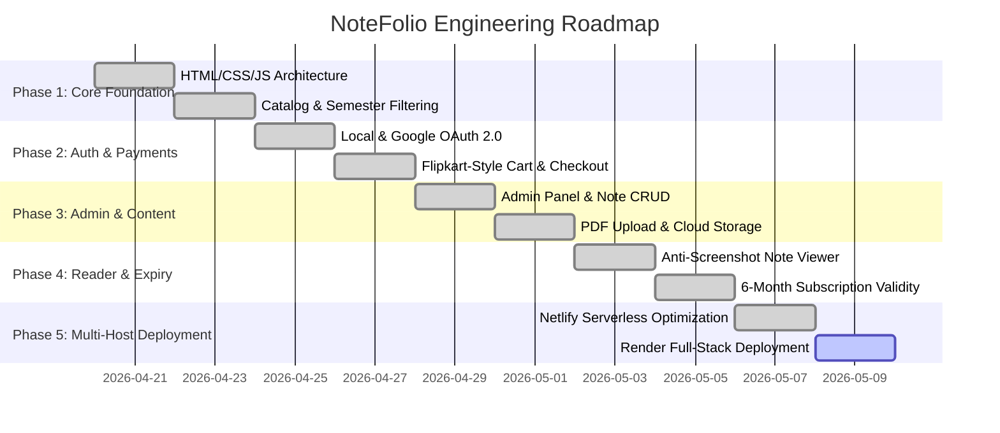

# NoteFolio Project Phases & Roadmap

---

## Phase Breakdown

### Phase 1: Core Foundation & Marketplace Layout
- Pure HTML5/CSS3 frontend architecture with responsive modern cards.
- Semester-wise navigation and branch/subject search filtering.
- Client-side mock data structure with chapter breakdown.

### Phase 2: User Authentication & Checkout Engine
- Dual authentication system: Local JWT auth + Google OAuth 2.0 redirect flow.
- Two-column Flipkart-style shopping cart with coupon engine (`NEW10`, `STUDENT20`, `BUNDLE15`).
- Order generation and payment gateway mock/Razorpay integration.

### Phase 3: Admin Dashboard & Cloud Asset Management
- Dedicated admin portal (`/admin-panel.html` & `/login.html`).
- Administrative note CRUD: upload new PDFs, assign price/semester, delete notes.
- Administrative user management: list active users, manage roles, and delete accounts.

### Phase 4: Protected PDF Reader & Expiry Engine
- Custom canvas-based PDF reader with table of contents, zooming, and text search.
- Anti-screenshot protection shield and `@media print` blockers.
- 6-Month note expiration calculation and self-service note removal from library.

### Phase 5: Multi-Platform Cloud Deployment
- **Netlify:** Decoupled serverless functions with automatic pretty-URL handling.
- **Render:** Unified Express service serving static assets and dynamic APIs under one domain.
- **Documentation & GitHub Readiness:** Full documentation suite and git-ready codebase.
